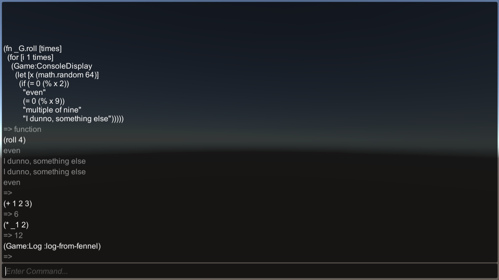

# Unity-Lua-Fennel-Starter
A Unity project to get started with Lua and Fennel

## What
A Unity project with everything needed for Lua and Fennel. Uses [NLua](https://github.com/NLua/NLua)/[KeraLua](https://github.com/NLua/KeraLua) to interface with lua. 

## Why
I integrated Lua (and then Fennel) into my current project. This became a really powerful tool in my game and I knew I was going to want it for game jams. Makes sense to share what I learned more broadly, I hope this helps you.

### Why not a package?
One day

## How
### Setup
1) Clone/Download
2) Open [UnityProject/](UnityProject/) in Unity

### Usage
The SampleScene is a good place to start; play the game and press backtick <code>`</code> to open the console (backtick or escape to close). Enter some some fennel code (default) and press enter to evaluate it. If you want to switch to Lua you can change the default in NLuaController or evaluate this fennel: <code>(lang)</code>

You can add your own fennel and lua code via modules that will be automatically required when you set them in the NLuaController inspector. The module name will be the filename (without extension).

You can interface with your Unity code via the [Bridge](UnityProject/Assets/UnityLuaFennelStarter/Scripts/Scripting/Bridge.cs) that NLuaController loads on Awake. Note the `Game:Log` and `Game:ConsoleDisplay` funcations can be called from within lua/fennel and they live within the `Game` c# class.

The console here isn't a standard fennel repl in order for swapping to lua; if this interests you [read this](https://github.com/bakpakin/Fennel/wiki/Unity#repl). However it does save the return of the previous statement to the global `_1`.
